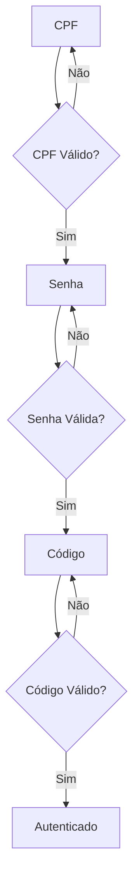

# AuthContext - Gerenciamento de Estado de Autenticação

## 📋 Índice

1. [Visão Geral](#visão-geral)
2. [Arquitetura do AuthContext](#arquitetura-do-authcontext)
3. [Estados e Variáveis](#estados-e-variáveis)
4. [Fluxo de Autenticação](#fluxo-de-autenticação)
5. [Cache de Pontos](#cache-de-pontos)
6. [Persistência de Dados](#persistência-de-dados)
7. [Sincronização entre Abas](#sincronização-entre-abas)
8. [Métodos Principais](#métodos-principais)
9. [Uso Prático](#uso-prático)
10. [Troubleshooting](#troubleshooting)

---

## 🎯 Visão Geral

O **AuthContext** é o coração do sistema de autenticação do Bem Especial. Ele gerencia todo o estado de autenticação do usuário, incluindo:

- ✅ **Autenticação multi-etapa** (CPF → Senha → Código)
- ✅ **Cache inteligente** de pontos com expiração
- ✅ **Persistência criptografada** no localStorage
- ✅ **Sincronização automática** entre abas
- ✅ **Proteção de rotas** com redirecionamento

### AuthContext

O AuthContext lida com:
- **Múltiplos estados** de autenticação
- **Dados sensíveis** que precisam ser criptografados
- **Cache** que pode ficar desatualizado
- **Sincronização** entre diferentes abas do navegador
- **Fallbacks** para quando algo dá errado

---

## 🏗️ Arquitetura do AuthContext

### Estrutura do Arquivo
```javascript
// src/contexts/AuthContext.jsx
export const AuthProvider = ({ children }) => {
  // Estados principais
  const [user, setUser] = useState(null);
  const [loading, setLoading] = useState(true);
  const [currentStep, setCurrentStep] = useState('cpf');
  const [isFullyAuthenticated, setIsFullyAuthenticated] = useState(false);
  
  // Cache de pontos
  const [pointsCache, setPointsCache] = useState({...});
  
  // Métodos de autenticação
  const consultarCPF = async (cpf) => {...};
  const cadastrarSenha = async (senha, confirmasenha) => {...};
  const validarCodigo = async (codigo) => {...};
  
  // ... outros métodos
};
```

### Fluxo de Dados
```
Usuário → AuthContext → API Service → Backend
    ↓
localStorage (criptografado) ← Cache de pontos
```

---

## 📊 Estados e Variáveis

### Estados Principais

| Estado | Tipo | Descrição |
|--------|------|-----------|
| `user` | `Object \| null` | Dados do usuário autenticado |
| `loading` | `boolean` | Estado de carregamento inicial |
| `currentStep` | `string` | Etapa atual do login (`cpf`, `password`, `code`, `authenticated`) |
| `isFullyAuthenticated` | `boolean` | Flag de autenticação completa |
| `error` | `string \| null` | Mensagens de erro |

### Cache de Pontos

```javascript
const [pointsCache, setPointsCache] = useState({
  data: null,        // Dados dos pontos
  timestamp: null,   // Quando foi carregado
  userId: null       // ID do usuário
});
```

**Expiração**: 5 minutos (300.000ms)

---

## 🔐 Fluxo de Autenticação

### Etapas do Login



### Estados de Autenticação

1. **`cpf`** - Tela inicial
   - Usuário insere CPF
   - Sistema verifica se existe

2. **`password`** - Tela de senha
   - Usuário cadastra ou valida senha
   - Sistema envia código por e-mail

3. **`code`** - Tela de código
   - Usuário insere código de 6 dígitos
   - Sistema valida e autentica

4. **`authenticated`** - Usuário logado
   - Acesso completo ao sistema

---

## 💾 Cache de Pontos

### Como Funciona

```javascript
// Verificar se o cache é válido
const isCacheValid = (userId) => {
  if (!pointsCache.data || pointsCache.userId !== userId) {
    return false;
  }
  
  const now = Date.now();
  const cacheAge = now - pointsCache.timestamp;
  
  return cacheAge < CACHE_EXPIRATION; // 5 minutos
};
```

### Quando o Cache é Limpo

- Usuário faz logout
- Cache expira (5 minutos)
- Usuário resgata voucher (atualização forçada)
- Erro na requisição

---

## 🔒 Persistência de Dados

### Criptografia

```javascript
// Dados são criptografados antes de salvar
const encryptedUser = encryptData(user);
localStorage.setItem('user', encryptedUser);

// Chave única por sessão
const secretKey = CryptoJS.SHA256(`${domain}-${sessionId}-bem-especial-2024`);
```

### Dados Persistidos

- **`user`**: Dados do usuário (criptografados)
- **`isFullyAuthenticated`**: Status de autenticação
- **`sessionId`**: ID único da sessão

### Recuperação de Dados

```javascript
useEffect(() => {
  const savedUser = localStorage.getItem('user');
  const savedAuthStatus = localStorage.getItem('isFullyAuthenticated');
  
  if (savedUser) {
    const userData = decryptData(savedUser);
    if (userData) {
      setUser(userData);
      setIsFullyAuthenticated(savedAuthStatus === 'true');
    }
  }
}, []);
```

---

## 🔄 Sincronização entre Abas

### Problema
Quando o usuário abre múltiplas abas, o estado pode ficar inconsistente.

### Solução
```javascript
useEffect(() => {
  const checkAuthState = () => {
    const savedUser = localStorage.getItem('user');
    const savedAuthStatus = localStorage.getItem('isFullyAuthenticated');
    
    if (savedUser && savedAuthStatus === 'true' && !isFullyAuthenticated) {
      const userData = decryptData(savedUser);
      if (userData) {
        setUser(userData);
        setIsFullyAuthenticated(true);
        setCurrentStep('authenticated');
      }
    }
  };

  // Verificar a cada 2 segundos
  const interval = setInterval(checkAuthState, 2000);
  return () => clearInterval(interval);
}, [isFullyAuthenticated, loading]);
```

### Eventos Customizados

```javascript
// Emitir evento quando pontos são atualizados
window.dispatchEvent(new CustomEvent('pointsUpdated'));

// Escutar evento em outros componentes
useEffect(() => {
  const handlePointsUpdate = () => {
    // Atualizar pontos no componente
  };
  
  window.addEventListener('pointsUpdated', handlePointsUpdate);
  return () => window.removeEventListener('pointsUpdated', handlePointsUpdate);
}, []);
```

---

## 🛠️ Métodos Principais

### Autenticação

#### `consultarCPF(cpf)`
```javascript
const consultarCPF = async (cpf) => {
  try {
    const response = await apiService.consultarCPF(cpf);
    
    if (response.success) {
      setUser(response.data);
      setCurrentStep('password');
      return response;
    }
  } catch (error) {
    // Tratamento de erro específico
    if (error.message.includes('Código não validado')) {
      setCurrentStep('code');
      return;
    }
    throw error;
  }
};
```

#### `cadastrarSenha(senha, confirmasenha)`
```javascript
const cadastrarSenha = async (senha, confirmasenha) => {
  try {
    const response = await apiService.cadastrarSenha(
      user.idparticipante, 
      senha, 
      confirmasenha
    );
    
    if (response.success) {
      setCurrentStep('code');
      return response;
    }
  } catch (error) {
    throw error;
  }
};
```

#### `validarCodigo(codigo)`
```javascript
const validarCodigo = async (codigo) => {
  try {
    const response = await apiService.validarCodigo(
      user.idparticipante, 
      codigo
    );
    
    if (response.success) {
      setIsFullyAuthenticated(true);
      setCurrentStep('authenticated');
      return response;
    }
  } catch (error) {
    throw error;
  }
};
```

### Gerenciamento de Pontos

#### `meusPontos(idparticipante, forceRefresh = false)`
```javascript
const meusPontos = async (idparticipante, forceRefresh = false) => {
  // Verificar cache primeiro
  if (!forceRefresh && isCacheValid(idparticipante)) {
    return pointsCache.data;
  }
  
  try {
    const data = await apiService.meusPontos(idparticipante);
    updatePointsCache(idparticipante, data);
    return data;
  } catch (error) {
    throw error;
  }
};
```

#### `forceRefreshPoints()`
```javascript
const forceRefreshPoints = () => {
  clearPointsCache();
  // Notificar outros componentes
  window.dispatchEvent(new CustomEvent('pointsUpdated'));
};
```

### Logout

#### `logout()`
```javascript
const logout = () => {
  // Limpar localStorage
  localStorage.removeItem('user');
  localStorage.removeItem('isFullyAuthenticated');
  
  // Limpar dados de sessão
  clearEncryptedData();
  clearPointsCache();
  
  // Resetar estados
  setError(null);
  setCurrentStep('cpf');
  setUser(null);
  setIsFullyAuthenticated(false);
};
```

---

## 💻 Uso Prático

### Em um Componente

```javascript
import { useAuth } from '../contexts/AuthContext';

const MyComponent = () => {
  const { 
    user, 
    isFullyAuthenticated, 
    meusPontos, 
    forceRefreshPoints 
  } = useAuth();
  
  const [points, setPoints] = useState(null);
  
  useEffect(() => {
    if (user && isFullyAuthenticated) {
      meusPontos(user.idparticipante)
        .then(data => setPoints(data))
        .catch(error => console.error(error));
    }
  }, [user, isFullyAuthenticated]);
  
  const handleRefresh = () => {
    forceRefreshPoints();
    // Recarregar pontos
    meusPontos(user.idparticipante, true)
      .then(data => setPoints(data));
  };
  
  return (
    <div>
      <h1>Meus Pontos: {points?.saldo || 0}</h1>
      <button onClick={handleRefresh}>Atualizar</button>
    </div>
  );
};
```

### Proteção de Rotas

```javascript
const PrivateRoute = ({ element }) => {
  const { user, loading, isFullyAuthenticated } = useAuth();
  
  if (loading) {
    return <LoadingSpinner />;
  }
  
  const isAuthenticated = user && user.idparticipante && isFullyAuthenticated;
  
  if (isAuthenticated) {
    return element;
  }
  
  return <Navigate to="/login" replace />;
};
```

### Escutar Atualizações de Pontos

```javascript
useEffect(() => {
  const handlePointsUpdate = () => {
    // Recarregar dados quando pontos são atualizados
    loadPoints();
  };
  
  window.addEventListener('pointsUpdated', handlePointsUpdate);
  return () => window.removeEventListener('pointsUpdated', handlePointsUpdate);
}, []);
```

---

## 🔧 Troubleshooting

### Problemas Comuns

#### 1. Estado Inconsistente
**Sintoma**: Usuário aparece logado mas não consegue acessar páginas
**Solução**: 
```javascript
// Forçar sincronização
const { syncAuthState } = useAuth();
syncAuthState();
```

#### 2. Cache Desatualizado
**Sintoma**: Pontos não atualizam após resgate
**Solução**:
```javascript
// Forçar refresh
const { forceRefreshPoints } = useAuth();
forceRefreshPoints();
```

#### 3. Dados Corrompidos
**Sintoma**: Erro ao carregar dados do localStorage
**Solução**:
```javascript
// Limpar dados corrompidos
localStorage.removeItem('user');
localStorage.removeItem('isFullyAuthenticated');
// Recarregar página
window.location.reload();
```

#### 4. Sincronização entre Abas
**Sintoma**: Estado diferente em abas diferentes
**Solução**: Aguardar 2 segundos para sincronização automática ou usar:
```javascript
// Forçar verificação
window.dispatchEvent(new CustomEvent('checkAuthState'));
```

### Logs Úteis

```javascript
// Adicionar logs para debug
console.log('AuthContext - Estado atual:', {
  user: !!user,
  isFullyAuthenticated,
  currentStep,
  pointsCache: pointsCache.data ? 'Válido' : 'Inválido'
});
```

---

## 📚 Recursos Adicionais

### Arquivos Relacionados
- `src/contexts/AuthContext.jsx` - Implementação principal
- `src/utils/encryption.js` - Criptografia de dados
- `src/services/apiService.js` - Comunicação com API

### Conceitos Importantes
- **Context API**: Gerenciamento de estado global
- **localStorage**: Persistência de dados
- **CryptoJS**: Criptografia AES-256
- **Custom Events**: Comunicação entre componentes

---

**Versão**: 1.0  
**Última Atualização**: Janeiro 2025  
**Autor**: Allan Dohkan 